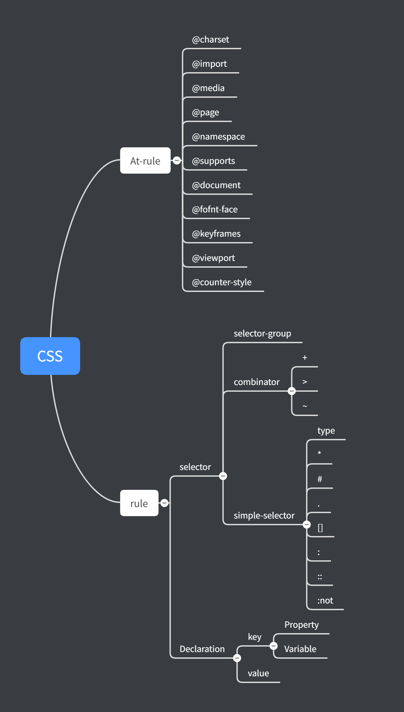

# 每周总结可以写在这里

1. 系统化学习

从原理上入手更容易掌握一个知识，而不是看具体有哪些功能

以 flex 为例，我以前一直在使用 flex 布局，一直查阅文档看flex有哪些属性，flex 与其他属性如 width 怎么相互影响，这些我本来都是通过记忆掌握的，结果就是很容易忘。现在通过原理上学习，就很容易说清楚，flex 布局下什么情况 width 会失效，为什么最后渲染结果会是这样等等问题，这些都是以前很少碰到，从而没办法学习到的知识点。

2. CSS 脑图

